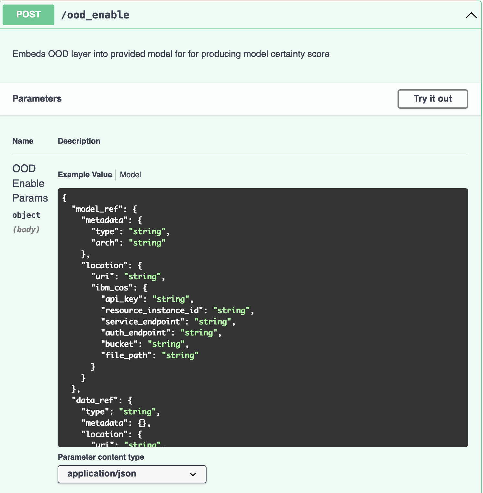
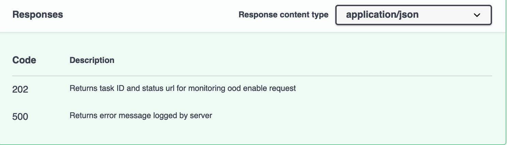
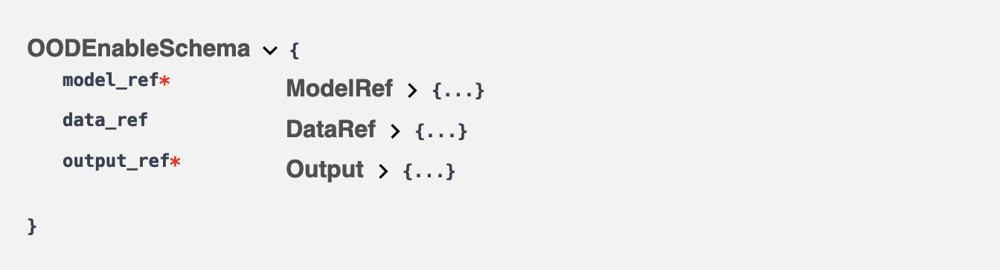
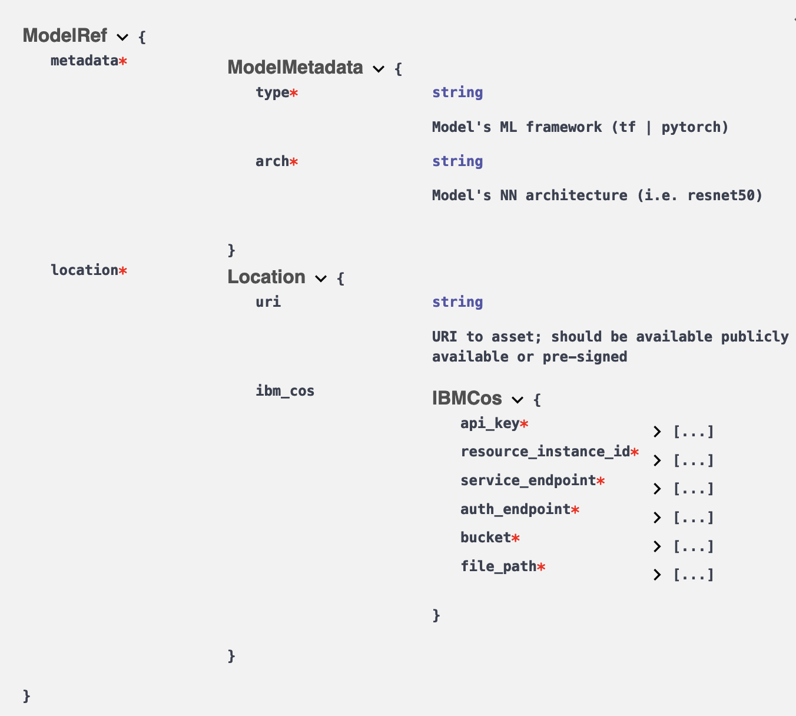
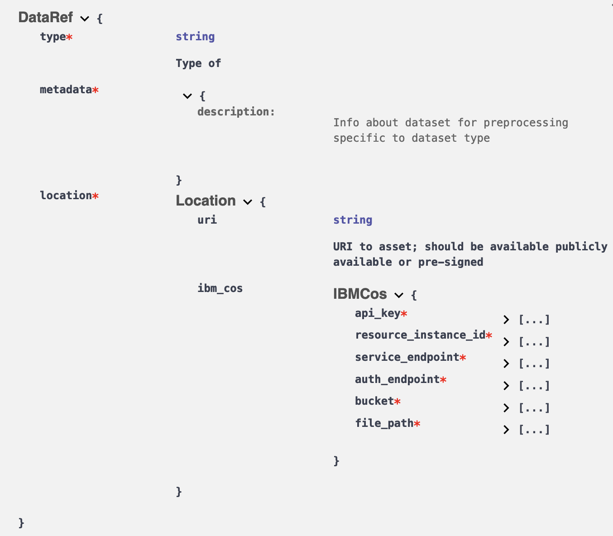
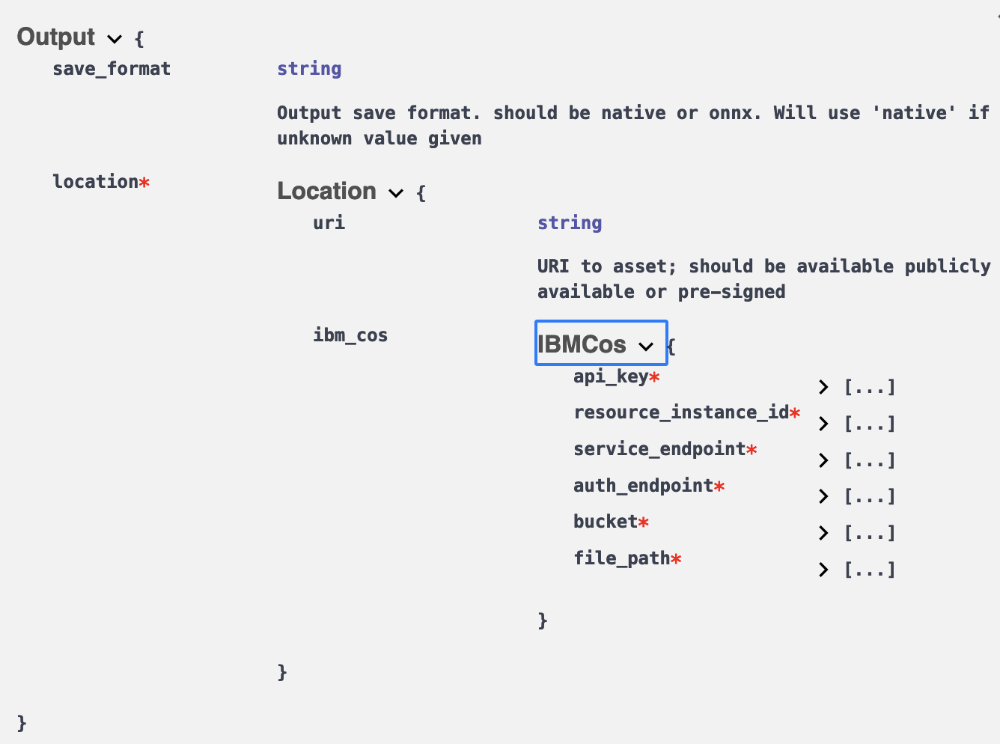

# OOD Enabler OpenAPI Spec

## Deploying REST Service container
The built image can be deployed using a `docker-compose.yaml` file - a base can be found in the [Docker directory.](https://github.ibm.com/Distributed-Data/ood/blob/main/Docker/docker-compose.yml)

#### Prerequisite:
The container uses tasks queues to handle model certainty enablement requests. Hence, a RESULT_BACKEND and BROKER service is necessary. [Redis](https://hub.docker.com/_/redis) is recommended to use since it provides both of these services and can easily be added to the environment by running:
```
docker pull redis
```  

### Deploy
The container can be deployed by running:
```
cd Docker/
docker-compose up -d
```


## REST Endpoint
There is a single REST API, which is `ood_enable`




The `ood_enable` call returns a task ID and endpoint to monitor the progress/status of the request.

## Parameters
The following shows the parameters to provide for the `ood_enable` API:



Both `model_ref` and `output_ref` are required, while `data_ref` is optional to normalized the OOD enabled model's outputs, but recommended.

Each parameter has it's own schema, which is a json specification defined as below: <br>
NOTE: for all `location` in refs, `uri` OR `ibm_cos` specification must be defined

### model_ref schema


### data_ref schema


### output_ref schema



## Example
An example call would like like:

```
model_ref = {
    "metadata": {
      "type": "tf",
      "arch": "resnet50"
    },
    "location": {
      "ibm_cos": {
        "api_key": "API_KEY",
        "resource_instance_id": "RESOURCE_INSTANCE_ID",
        "service_endpoint": "https://s3.us-east.cloud-object-storage.appdomain.cloud",
        "auth_endpoint": "https://iam.cloud.ibm.com/oidc/token",
        "bucket": "test",
        "file_path": "test/tf_resnet50.tar.gz"
          }
      }
  }

dataset_ref = {
    "metadata": {'img_height': 224, 'img_width': 224, 'batch_size': 32},
    "location": {
        "ibm_cos": {
            "api_key": "API_KEY",
              "resource_instance_id": "RESOURCE_INSTANCE_ID",
              "service_endpoint": "https://s3.us-east.cloud-object-storage.appdomain.cloud",
              "auth_endpoint": "https://iam.cloud.ibm.com/oidc/token",
              "bucket": "test",
              "file_path": "test/dataset.tar.gz"
            }
        }
    }

output_ref = {
    "location": {
        "ibm_cos": {
              "api_key": "API_KEY",
              "resource_instance_id": "RESOURCE_INSTANCE_ID",
              "service_endpoint": "https://s3.us-east.cloud-object-storage.appdomain.cloud",
              "auth_endpoint": "https://iam.cloud.ibm.com/oidc/token",
              "bucket": "test",
              "file_path": "results"
              }
            }
        }

url = "http://localhost:8443/ood_enable"

payload = {'model_ref': model_ref, 'data_ref': dataset_ref, 'output_ref': output_ref}

r = requests.post(url, json=payload)

```

if successful, the output will look like the follwing, with a status code of `202`:
```
{"task_id":"f350d129-c9e0-4e30-bf55-3a3257381510","status_url":"/ood_enable/status/f350d129-c9e0-4e30-bf55-3a3257381510"}
```
the `status_url` endpoint can be used to check the status of the requests
```
r = requests.get("http://localhost:8443/ood_enable/status/f350d129-c9e0-4e30-bf55-3a3257381510)
```

The resulting json response would be:
```
{"state":"PROGRESS","status":"enabling ood model..."}
```

When complete, the result would be:
```
'state': 'SUCCESS', 'status': 'Task completed! model saved at test/results/}
```
Where the saved location would be the one defined in `output_ref`
